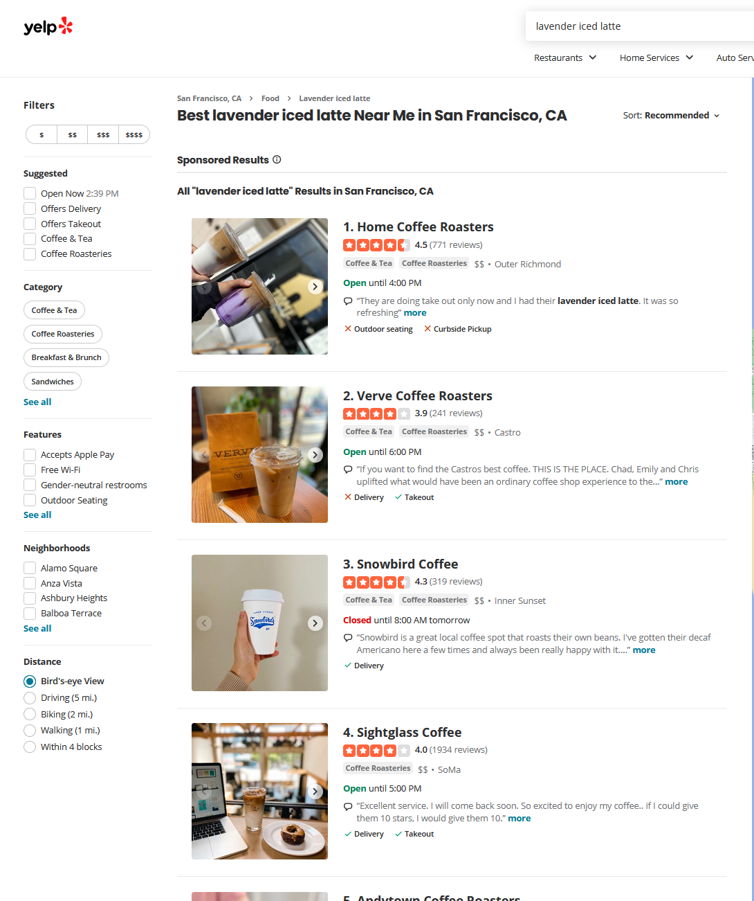
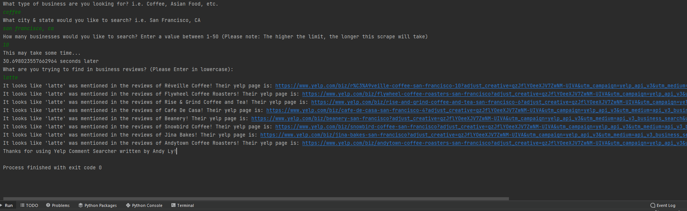

# Yelp Comment Searcher Project

## A work in progress, allows the user to search local business's comments for a specific phrase.

The project is a way of assessing a local business for a specific item and verifying the eexistence through its reviews.
For example, if I wanted to look for a "Lavender iced latte" local to me through yelp, there isn't a gaurantee that the results will have what i'm looking for.
Instead, Yelp will return a general search of coffee and will occasionally show a review highlighting the searched term.

Here is what the program will execute:

### This project notably uses:
* BeautifulSoup to scrape comments
* Yelp-Fusion-Api to get: Business URLs, Limit of businesses to search, Location.
     NOTE: Requires Yelp-Fusion-API key to use
* Python language

#### To-do / Planned ideas
* Use BeautifulSoup4 to scrape every review for each business #Currently able to get the reviews from the main business page
* Allow the user to search without the use of Yelp's API
* Optimize BeautifulSoup time to return results
